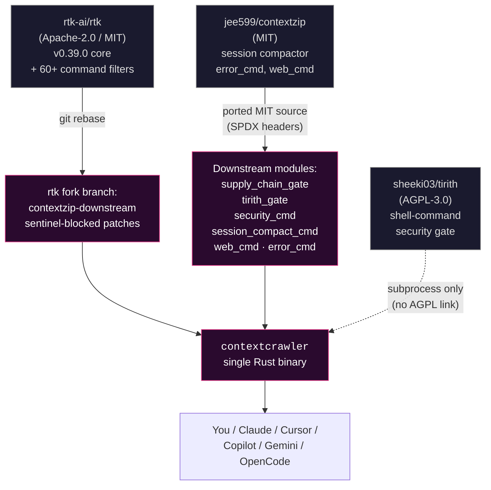
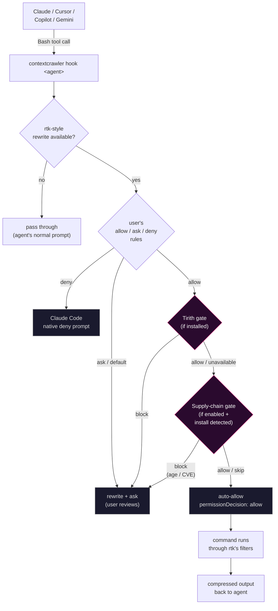

<p align="center">
  
</p>

# ContextCrawler

> [!WARNING]
> **Active development. Might work, might not. Use at your own risk.**
>
> This is a fast-moving downstream fork by one person. Before depending on
> it: build it yourself, test it against your own workflow, read the diff
> on top of upstream rtk, and run the code through your favourite LLM for
> a second opinion (why not). **Don't trust me — verify.** Bug reports
> welcome; expectations of stability shouldn't be.

ContextCrawler is a CLI proxy for AI coding agents (Claude Code, Cursor,
Copilot, Gemini, …) that does two things:

1. **Compresses** noisy command output before it eats your LLM context window.
2. **Gates** risky shell commands and supply-chain installs before any
   auto-approval reaches the agent.

One binary, one name: **`contextcrawler`**.

## Built from

| Component | What it brings | License |
|---|---|---|
| [rtk-ai/rtk](https://github.com/rtk-ai/rtk) | The core CLI proxy framework: 60+ command filters (git, cargo, npm, kubectl, docker, …), the permission-verdict system (`allow` / `ask` / `deny` / `default`), and the agent-hook entrypoints used by every supported integration. Tracked via rebase against tagged releases. | Apache-2.0 / MIT |
| [jee599/contextzip](https://github.com/jee599/contextzip) | The session-JSONL compactor for Claude Code, the multi-language stacktrace compressor (Node / Python / Rust / Go / Java), and the HTML web-content extractor. Ported forward to current rtk with per-file SPDX headers preserving attribution. | MIT |
| [Tirith](https://tirith.sh) ([sheeki03/tirith](https://github.com/sheeki03/tirith)) | A shell-syntax security inspector. ContextCrawler invokes it via subprocess as an optional defense-in-depth gate on the auto-allow path — block-level findings downgrade the verdict to *Ask*. | AGPL-3.0 (subprocess-only) |

Plus one capability **built in-tree**:

| Component | What it brings | Where |
|---|---|---|
| Supply-chain gate | Pre-install age-of-release + OSV CVE lookup for `npm` / `pnpm` / `yarn` and `pip` / `uv` / `poetry` / `pipx` installs. Honors pinned versions; caches lookups for 24 h. Opt-in via `~/.config/contextcrawler/supply-chain.toml`. | `src/hooks/supply_chain_gate.rs` |

## Goal

Make AI coding agents both **cheaper** and **safer** without changing how
you work:

- **Cheaper** — compress noisy command output before it eats your LLM
  context window. Inherits rtk's 60+ command filters, adds session-log
  compaction, HTML extraction, multi-language stacktrace compression.
- **Safer** — when an agent proposes a shell command, run it past two
  optional gates before auto-approving: shell-syntax inspection (Tirith)
  and pre-install supply-chain checks (package age + OSV CVE lookup).
  Neither is mandatory; both are opt-in.

## Capabilities

Grouped by which upstream the capability comes from. Everything is one
binary; the split is for navigation, not packaging.

### 1. Context & cache (from rtk + contextzip)

| Command | Purpose | Source |
|---|---|---|
| `contextcrawler <git / cargo / npm / …>` | Drop-in for everyday rtk-style filtering — 60+ command filters inherited from upstream. | rtk |
| `contextcrawler web <url>` | Fetch a URL and strip HTML chrome (nav, ads, scripts). ~86% byte savings on typical landing pages. | contextzip |
| `contextcrawler sessions compact <id>` | Compact a Claude Code session-JSONL log. Dedupes repeated file-reads, recompresses past Bash outputs. Sidecar-based; never touches the original. | contextzip |
| `contextcrawler sessions apply <id>` / `expand <id>` | Promote a sidecar to live, or roll it back. | contextzip |
| Stacktrace compressor | Detects framework frames in Node / Python / Rust / Go / Java tracebacks and drops them. Wired into the runner pipeline — automatic. | contextzip |
| `contextcrawler gain` | Token-savings stats. Preserves your existing `contextzip` SQLite DB. | rtk |
| `contextcrawler init -g` | Register the agent hook with Claude Code (and other agents via `--agent`). | rtk |
| `contextcrawler hook claude` / `cursor` / `copilot` / `gemini` | Built-in agent-hook entrypoints. Configured by `contextcrawler init -g`. | rtk |

### 2. Security gate (Tirith pairing)

Optional. The gate only fires when [`tirith`](https://tirith.sh) is on
`PATH`; fail-open by default. Invoked subprocess-only — no statically
linked AGPL code.

| Command | Purpose | Source |
|---|---|---|
| `contextcrawler security` | Tirith integration dashboard — audit stats, gate mode, shell-hook status, top detection rules. | downstream |
| `contextcrawler security log` | Merged gate-activity log: Tirith downgrades + supply-chain events, sorted by time. `--limit N`, `--json`. | downstream |
| `contextcrawler security log --histogram` | Bucketed counts of gate activity by `(source, category)` with proportional bars. Three-line situational awareness. | downstream |
| Tirith pre-execution gate | Routes auto-allow rewrites through `tirith check` first. Block-level findings downgrade to *Ask* so the user reviews the original command. | downstream + Tirith |

**Env knobs:**

| Variable | Effect |
|---|---|
| *(default)* | fail-open: if Tirith isn't installed, no gate, original rtk verdict stands |
| `CONTEXTCRAWLER_TIRITH_REQUIRED=1` | fail-closed: refuse auto-allow without a working Tirith verdict |
| `CONTEXTCRAWLER_TIRITH_DISABLED=1` | bypass the gate entirely (debug only) |

When the gate blocks a legitimate command (the most common case is a
`curl ... | python3` REST workflow matching the `curl | bash` shape),
see [`docs/security/working-with-the-gate.md`](docs/security/working-with-the-gate.md)
for diagnosis, the gate-safe network-fetch pattern, and `tirith trust`
allowlisting.

### 3. Supply-chain pipeline control

Optional. Opt-in via `~/.config/contextcrawler/supply-chain.toml`.
Detects `npm`/`pnpm`/`yarn` and `pip`/`uv`/`poetry`/`pipx` install
commands; blocks auto-allow when the resolved version is younger than a
configurable cooldown or carries OSV-known CVEs.

| Command | Purpose |
|---|---|
| `contextcrawler supply-chain check '<cmd>'` | Inspect an install command. Reports age, CVEs, verdict. Useful for shell-side spot-checks before sharing a snippet with an agent. |
| Supply-chain pre-install gate | Runs automatically on auto-allow when an install is detected. Block reasons (age below cooldown, known CVE) downgrade to *Ask*. Honors pinned versions; cached for 24 h at `~/.cache/contextcrawler/supply-chain/`. |
| Config: `[npm].cooldown_days`, `[pypi].cooldown_days` | Minimum days since publish before auto-allow (default `3`). |
| Config: `[npm].block_severity`, `[pypi].block_severity` | Minimum OSV severity that blocks (default `HIGH`). |
| Config: `[overrides].always_allow`, `[overrides].always_deny` | Per-package globs (`@types/*` etc.) to bypass either side of the gate. |

## Sample output

The histogram subcommand is the quickest way to see what the gates are
doing in your environment:

```text
$ contextcrawler security log --histogram

ContextCrawler Gate Activity — Histogram
════════════════════════════════════════════════════════════
  Sources:
    ~/Library/Application Support/contextcrawler/downgrades.jsonl
    ~/Library/Application Support/contextcrawler/supply_chain.jsonl
  Total events: 43

  supply-chain  skip                              20  ████████████████████████
  supply-chain  block                             11  █████████████
  supply-chain  allow                              7  ████████
  tirith        tirith_block                       3  ████
  supply-chain  unavailable                        1  █
  tirith        tirith_required_unavailable        1  █

  Auto-allow decisions are not logged — only gate downgrades and
  supply-chain verdicts. Use `contextcrawler gain` for total command volume.
```

The Tirith dashboard, when Tirith is installed:

```text
$ contextcrawler security

ContextCrawler Security (Tirith Integration)
════════════════════════════════════════════════════════════

  Tirith binary: ~/.cargo/bin/tirith (0.3.1)
  Shell:         zsh
  Shell hook:    NOT configured (commands NOT intercepted at the shell)
  Rewrite gate:  fail-open (default)

Audit Log Summary
────────────────────────────────────────────────────────────
  Commands analyzed: 2189
  Findings:          154
  Action breakdown:  Allow 2129 | Warn 3 | Block 57 (2.6% block rate)

Top detection rules:
     32  raw_ip_url
     27  plain_http_to_sink
     24  private_network_access
     21  pipe_to_interpreter
      8  schemeless_to_sink
      ...
```

A supply-chain check that finds something:

```text
$ contextcrawler supply-chain check 'pip install requests==2.20.0'

[contextcrawler supply-chain] BLOCKED
  requests [PyPI]: GHSA-9hjg-9r4m-mvj7 — Requests vulnerable to .netrc credentials leak via malicious URLs (severity High)
  requests [PyPI]: GHSA-9wx4-h78v-vm56 — Requests `Session` object does not verify requests after making first request with verify=False (severity High)
  requests [PyPI]: GHSA-gc5v-m9x4-r6x2 — Requests has Insecure Temp File Reuse in its extract_zipped_paths() utility function (severity High)
  requests [PyPI]: GHSA-j8r2-6x86-q33q — Unintended leak of Proxy-Authorization header in requests (severity High)
  requests [PyPI]: PYSEC-2023-74 — (no summary) (severity High)
  Overrides: rerun with CONTEXTCRAWLER_SUPPLY_CHAIN=off, or add the package
  to ~/.config/contextcrawler/supply-chain.toml [overrides.always_allow]
```

The default tail of `security log` shows the same events in chronological
order with per-finding detail — handy when triaging which install or which
shell pattern actually fired.

### Live dashboard — `gain --web`

For glanceable, per-day / per-tool trend views, boot the local dashboard:

```bash
contextcrawler gain --web                  # free port, opens browser
contextcrawler gain --web --port 8765      # pinned port
contextcrawler gain --web --no-browser     # ssh / headless
```

Read-only, loopback-only (`127.0.0.1`), no auth, auto-shutdown after 1h
idle. Six panes — summary, by-day sparkline, weak filters, parse failures,
release boundaries, insights — all backed by the same `Tracker` queries
the text-mode subcommands use. Themed in synthwave neon (pink / purple /
cyan) because that's how dashboards should look.

## Diagrams

Click each section to expand. All diagrams are top-to-bottom Mermaid;
GitHub renders them inline.

<details>
<summary><strong>1. Project lineage — where each piece comes from</strong></summary>



</details>

<details>
<summary><strong>2. Runtime flow — what happens when an agent proposes a command</strong></summary>



</details>

## Install

Requires a Rust toolchain (`rustup`, stable channel). There are no
pre-built binaries — single-maintainer fork, build it yourself.

> [!IMPORTANT]
> **If you previously ran upstream `rtk` or `jee599/contextzip`**, your
> agent configs likely still hold hook entries pointing at the old
> `rtk` binary or `~/.claude/hooks/rtk-rewrite.sh` etc. Those will
> silently fail-open once `contextcrawler` takes over. Clean them out
> first — at minimum:
>
> ```sh
> # If you have the old binary, use its own uninstall first.
> rtk init -g --uninstall    2>/dev/null || true
>
> # Then check (and remove leftovers manually) in:
> #   ~/.claude/settings.json        — PreToolUse hook entry
> #   ~/.claude/hooks/rtk-rewrite.sh — leftover hook script
> #   ~/.claude/RTK.md / @RTK.md ref in CLAUDE.md
> #   ~/.cursor/hooks.json           — Cursor hook entry
> #   ~/.codex/AGENTS.md             — Codex rules block
> #   ~/.windsurfrules, ~/.clinerules — rules files
> ```
>
> After installing `contextcrawler` (below), `contextcrawler init -g`
> re-creates everything cleanly for whichever agents you use.

**One-liner with `cargo install` (latest release):**

```sh
cargo install --git https://github.com/thehoff/contextcrawler --tag v0.1.6 --locked
```

This drops `contextcrawler` into `~/.cargo/bin/`. Make sure that's on
your `PATH`. Bump the `--tag` value when newer releases ship — see the
[releases page](https://github.com/thehoff/contextcrawler/releases).

**Or clone and build (recommended if you want to read the diff first):**

```sh
git clone https://github.com/thehoff/contextcrawler.git
cd contextcrawler
git checkout v0.1.6                # pin to the latest tagged release
scripts/build-release.sh --install # strips build paths + copies to ~/.local/bin
```

The `build-release.sh` helper sets `--remap-path-prefix` so the binary
does not embed your `$HOME` / `$CARGO_HOME` / workspace path in panic
backtrace metadata. Plain `cargo build --release` works too but will
leak those paths.

**Bleeding edge** (unreleased fixes on `develop`, expect churn):

```sh
cargo install --git https://github.com/thehoff/contextcrawler --branch develop --locked
# or, in a clone, omit the `git checkout v0.1.0` step above
```

**Wire up the agent hook(s):**

Each agent needs its own init call — `init -g` only writes the chosen
agent's config per invocation. Run as many as you use; the hook scripts
for every supported agent are bundled into the binary, so you don't
need to install anything else.

```sh
contextcrawler init -g                       # Claude Code (default)
contextcrawler init -g --opencode            # OpenCode plugin (additive: also installs Claude)
contextcrawler init -g --copilot             # GitHub Copilot (VS Code + CLI)
contextcrawler init -g --gemini              # Gemini CLI
contextcrawler init -g --codex               # Codex CLI
contextcrawler init -g --agent cursor        # Cursor Agent (editor + CLI)
contextcrawler init -g --agent windsurf      # Windsurf (Cascade)
contextcrawler init -g --agent cline         # Cline / Roo Code (VS Code)
contextcrawler init -g --agent kilocode      # Kilo Code
contextcrawler init -g --agent antigravity   # Google Antigravity
```

`contextcrawler init --show` prints what's currently registered.
`contextcrawler init -g --uninstall` reverses the last install for the
selected agent. See `contextcrawler init --help` for the full surface
(`--hook-only`, `--auto-patch`, `--no-patch`, `--claude-md` legacy).

**Optional defense-in-depth gate:**

```sh
# ContextCrawler shells out to `tirith` directly, so the binary on PATH
# is all the gate needs — no shell hook required.
cargo install tirith

# Optional separately: have Tirith also vet your own typed commands.
# eval "$(tirith init --shell zsh)"   # or bash / fish
```

**Optional supply-chain gate** (opt-in):

```sh
mkdir -p ~/.config/contextcrawler
cat > ~/.config/contextcrawler/supply-chain.toml <<'EOF'
[supply_chain]
enabled = true

[npm]
cooldown_days  = 3
block_severity = "HIGH"

[pypi]
cooldown_days   = 3
block_severity  = "HIGH"
allow_editable  = true
EOF
```

## License

The downstream parts of this repository are MIT.

- Upstream rtk content remains under its original license terms (see
  the root `LICENSE`). Note that upstream rtk's repo is internally
  inconsistent (`LICENSE` says Apache-2.0; `Cargo.toml` says MIT). We
  preserve those upstream files as-is.
- Source files we add or carry over carry per-file SPDX-License-Identifier
  headers citing their origin (jee599/contextzip MIT for ported modules;
  ContextCrawler contributors MIT for new additions).
- Tirith is AGPL-3.0 and is **only invoked via subprocess**; no statically
  linked AGPL code in this distribution.

## Attribution

- [rtk-ai/rtk](https://github.com/rtk-ai/rtk) — upstream base. Active,
  47K stars, current release v0.39.0. ContextCrawler tracks their tagged
  releases.
- [jee599/contextzip](https://github.com/jee599/contextzip) — source of the
  session compactor, stacktrace compressor, and HTML extractor. Each
  carried-over file has a per-file SPDX header citing this upstream.
- [sheeki03/tirith](https://github.com/sheeki03/tirith) — invoked via
  subprocess for the optional defense-in-depth gate.

## Status

v0.1.0 — first community release. See [`CHANGELOG.md`](CHANGELOG.md).
