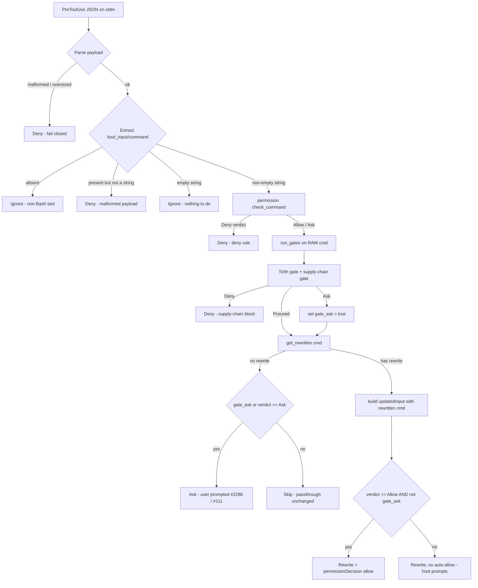

# Architecture overview

This page describes how ContextCrawler is structured as of 0.4.0, for
contributors and for anyone embedding the library. It is synthesised from the
source; the code in `src/` is the source of truth.

## The lib + bin split

ContextCrawler is one crate that builds both a library and a binary from a
single compile tree.

- **`src/main.rs`** is a five-line shim. It calls the library and exits with the
  returned code:

  ```rust
  fn main() {
      std::process::exit(contextcrawler::run());
  }
  ```

- **`src/lib.rs`** is the crate root. It declares the whole module tree
  (`analytics`, `api`, `cmds`, `core`, `discover`, `hooks`, `learn`, `parser`,
  `cli`) and re-exports the curated public surface. See
  [ContextCrawler as a library](./library.md) for that surface.

- **`src/cli.rs`** holds `pub fn run() -> i32`, the actual CLI. It defines the
  clap command tree, dispatches each subcommand to its filter module, and
  returns the process exit code.

Because the binary is a shim over `cli::run`, the binary exercises the exact
code path a downstream embedder would. There is no separate "binary-only" logic
to drift out of sync.

`run()` does three things in order before dispatching:

1. On Unix, reset `SIGPIPE` to `SIG_DFL` so a broken pipe on stdout terminates
   cleanly (exit 141) instead of panicking inside `println!`.
2. Call `core::path_migrate::migrate_legacy_dirs_once()` (see
   [Path migration](#path-migration) below).
3. Run `run_cli()`, mapping any `anyhow::Error` to a stderr line and exit code 1.

## Two hook entry paths

ContextCrawler integrates with AI coding agents through a PreToolUse-style hook.
There are two code paths, and only one is live in the Claude Code wiring:

| Path | Entry point | File | Status |
|------|-------------|------|--------|
| Live | `contextcrawler hook claude` | `src/hooks/hook_cmd.rs` | This is what runs for Claude Code. |
| Legacy | `contextcrawler rewrite <cmd>` | `src/hooks/rewrite_cmd.rs` | Older path, still compiled. |

Both share the gate logic in `src/hooks/tirith_gate.rs` and
`src/hooks/supply_chain_gate.rs`. The decisive difference is **gate ordering**:
the live path gates the raw command *before* deciding on a rewrite, so every
command class is gated. The legacy path gates inside the rewrite branch and so
has a known gap for non-rewritable commands. New work should follow the live
path's ordering.

## The Claude Code hook flow

The live flow lives in `hook_cmd.rs`. The agent sends a PreToolUse JSON payload
on stdin; `run_claude` reads it (size-limited, failing closed on a malformed or
oversized payload) and hands the parsed value to
`process_claude_payload_with_gate`.

The critical ordering property: the **defence-in-depth gates run on the RAW
command before any rewrite is computed.** A rewrite never has the chance to mask
a flagged command from the gate.



Things worth calling out:

- **Fail closed on shape errors.** A payload whose `command` is not a non-empty
  string, or that cannot be parsed at all, returns `Deny`. The hook never lets a
  command it could not reason about run unchecked.
- **A gate `Ask` always wins over a permissions `Allow` (#100 / #197).** When a
  gate flags a command, the auto-allow is suppressed: even with an explicit
  `Allow` rule, ContextCrawler omits `permissionDecision` so Claude Code prompts
  the user. A copy-paste trust hint from the Tirith verdict is surfaced as the
  prompt reason where available.
- **A permission `Ask` is never silently dropped (#2286).** If the command has
  no rewrite but `check_command` returned `Ask` (a not-auto-evaluable construct
  such as command substitution or a file-write redirect, or an explicit
  ask-rule), the hook escalates to a real Claude Code `ask` rather than skipping.
  Without this, a host `Bash(git:*)` allow rule could auto-approve something like
  `git status $(whoami)`.
- **Supply-chain hard block is a `Deny`.** A supply-chain `Deny` verdict fails
  closed; an `Unavailable` or `Ask` from the (opt-in) supply-chain gate also
  fails closed to a prompt rather than waving an install through.

Gate wiring (`run_gates`) is shared between this hook path and the
`contextcrawler proxy` CLI path, so proxy no longer bypasses the gates. Both
gates are opt-in and default off: with Tirith unavailable and the supply-chain
gate disabled, the path is byte-for-byte the same as no gate at all.

## The filter pipeline

For a command that *is* run through ContextCrawler (rather than gated at the hook
layer), the pipeline is:

```text
command  ->  routing / rewrite lookup  ->  filter module  ->  tracking
```

1. **Routing.** The clap command tree in `cli.rs` routes a recognised command
   (`git`, `cargo`, `pytest`, `grep`, ...) to its typed subcommand. On the hook
   path, `rewrite_command` in `src/discover/registry.rs` maps a raw command
   string to its `contextcrawler` equivalent and returns `None` when there is no
   equivalent.
2. **Filter module.** Each ecosystem has a module under `src/cmds/<ecosystem>/`.
   The module runs the real underlying tool, captures its output, and applies a
   filter to produce the compact form. The shared execution skeleton lives in
   `src/core/runner.rs`; the `no_bloat` guard there ensures a filter never emits
   more tokens than the raw baseline would have cost.
3. **Tracking.** Input and output token counts are recorded so
   `contextcrawler gain` can report savings (see [Config and data
   layout](#config-and-data-layout)).

When clap does not match a typed subcommand, `run_fallback` takes over. It:

- refuses to fall back for ContextCrawler's own meta-commands (so a typo in
  `gain --badflag` shows clap's error rather than trying to run `gain` from
  `PATH`);
- applies cloud-CLI hardening (per-tool argument deny-lists and environment
  stripping) for `kubectl`, `docker`, `aws`, `psql`, `curl`, `wget`, `gh`,
  `glab`, `gt`;
- otherwise looks up a project or global TOML filter (`find_matching_filter`,
  bypassable with `CTXCRL_NO_TOML=1`) and applies it, or finally passes the
  command through unfiltered.

Commands that take the raw-passthrough branch are recorded as parse failures
(zero savings) so `contextcrawler gain --failures` can surface them.

## Config and data layout

Path basenames are defined once in `src/core/constants.rs`
(`RTK_DATA_DIR = "ctxcrl"`):

| What | Path |
|------|------|
| User config | `~/.config/ctxcrl/config.toml` |
| User filters | `~/.config/ctxcrl/filters.toml` |
| Trusted filters | `~/.config/ctxcrl/trusted_filters.json` |
| Project-local filters | `./.ctxcrl/filters.toml`, `./.ctxcrl/filters/*.toml` |
| Tracking database | `~/.local/share/ctxcrl/history.db` (SQLite) |

The tracking database path can be overridden with the `CTXCRL_DB_PATH`
environment variable; this also acts as the explicit opt-in that lets a caller
redirect tracking writes (for example in tests, which otherwise redirect to a
per-process temp file so they never touch the production database).

## The environment-variable shim

The canonical env-var prefix is `CTXCRL_`. The legacy `RTK_` prefix is still
honoured as a deprecated fallback. All runtime env reads go through
`src/core/env_compat.rs`, which is the only place the old prefix survives:

- `env_var("CTXCRL_FOO")` returns `CTXCRL_FOO` if set, otherwise falls back to
  `RTK_FOO`. The canonical name always wins when both are set.
- `env_flag(...)` is true when the canonical or legacy var equals exactly `"1"`.
- `env_present(...)` is true when either name is set to any value.

So `CTXCRL_NO_TOML`, `CTXCRL_DB_PATH`, and friends are the names to use; the
matching `RTK_*` names keep older setups working but are slated for removal.

## Path migration

On every run, `core::path_migrate::migrate_legacy_dirs_once()` moves on-disk
settings from the legacy `rtk` directory names to the canonical `ctxcrl` names.
It is cheap, idempotent (guarded by a `std::sync::Once`), and runs before
anything reads config or filters.

What it does:

- Migrates the schema-stable settings files (`config.toml`, `filters.toml`,
  `trusted_filters.json`) from the legacy `rtk` segment in both the user config
  dir and the user data dir. Each file is checked **independently**: a
  pre-existing destination directory (for example one already holding a fresh
  `history.db` or `.device_salt`) never blocks moving a file whose destination
  is still absent. An existing destination file is never overwritten.
- Migrates the project-local `./.rtk` directory to `./.ctxcrl` - a whole-dir
  move when the destination is absent, otherwise a per-file migration of the
  known filter payload.
- Refuses to migrate a **symlinked** legacy `.rtk` directory, so a planted
  symlink cannot redirect the move.

What it deliberately does **not** do: migrate `history.db`. The tracking
database is a complete reset. A fresh database with the current schema is created
at the new `ctxcrl` path on first run, and any old-path database is left
orphaned and untouched. There is no DB back-compat and no `ALTER`.

## Module map

For contributors, the top-level layout under `src/`:

| Module | Responsibility |
|--------|----------------|
| `main.rs` | Binary shim - calls `contextcrawler::run()`. |
| `lib.rs` | Crate root - module tree + curated public re-exports. |
| `cli.rs` | clap command tree, `pub fn run`, routing, clap-fallback path. |
| `api.rs` | Curated filtering API (`filter_output`, `auto_filter_output`, `available_filters`). |
| `core/` | Shared infrastructure: `config`, `tracking`, `tee`, `utils`, `filter`, `toml_filter`, `output_summary`, `runner`, `env_compat`, `path_migrate`, `constants`, `telemetry`. |
| `hooks/` | Hook system: `hook_cmd` (live Claude path), `rewrite_cmd` (legacy), `tirith_gate`, `supply_chain_gate`, `permissions`, `init`, `trust`, `integrity`, `verify_cmd`. |
| `analytics/` | Token-savings reporting: `gain`, `cc_economics`, `ccusage`, `session_cmd`. |
| `cmds/` | Per-ecosystem filter modules: `git/`, `rust/`, `js/`, `python/`, `go/`, `jvm/`, `dotnet/`, `cloud/`, `system/`, `ruby/`. |
| `discover/` | Claude Code history analysis (missed-savings discovery), plus `registry` - the command-to-rewrite map (`rewrite_command`) the hook path uses. |
| `learn/` | CLI-correction detection from error history. |
| `parser/` | Parser infrastructure shared by filters. |
| `filters/` | TOML filter configs (the DSL filter definitions). |

## See also

- [ContextCrawler as a library](./library.md) - the embeddable public API.
